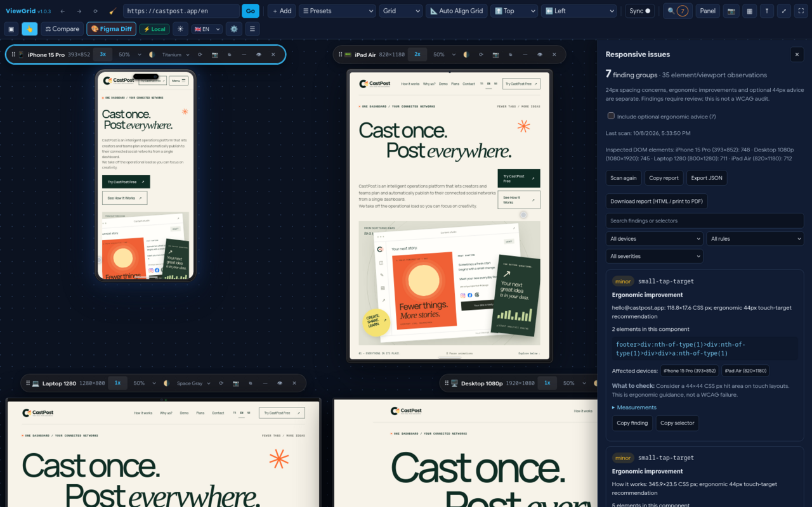

  

<h1 align="center">Sinan Sarıkaya</h1>

<strong>Full-stack developer & product builder</strong> · Stavanger, Norway

I build software from idea to production.

  <a href="https://sinansarikaya.dev">Website</a> ·
  <a href="https://sinansarikaya.dev/en/projects">Projects</a> ·
  <a href="https://sinansarikaya.dev/en/now">Now</a> ·
  <a href="https://www.linkedin.com/in/sinansarikaya/">LinkedIn</a> ·
  <a href="mailto:me@sinansarikaya.dev">Email</a>

---

I design, build and run web applications, SaaS products, APIs and developer tools. My work spans the interface, backend and infrastructure, with an emphasis on clear architecture and software that keeps working after launch.

## Selected work

### [ViewGrid](https://viewgrid.sinansarikaya.dev/) — responsive testing in one tab

Checking a layout on phone, tablet and desktop usually means resizing one window over and over; ViewGrid shows all of those viewports side by side and keeps scroll, clicks and form input in sync.

  

- **What I did:** designed and built the extension, its product site and the release pipeline for Chrome and Firefox.
- **Technical decision:** the Firefox build stays on Manifest V2, because Firefox MV3 cannot relax framing headers. Framing exceptions apply only to verified ViewGrid workspace tabs, so normal browsing keeps its protections.
- **Quality:** CI runs unit tests and real-browser extension flows in Chromium and Firefox with Playwright.
- **Stack:** TypeScript, Vite, WebExtensions, Playwright

[Source](https://github.com/sinansarikaya/viewgrid) · [Website](https://viewgrid.sinansarikaya.dev/) · [Chrome Web Store](https://chromewebstore.google.com/detail/viewgrid-%E2%80%94-responsive-vie/hmlhooeamfmhdeichnghcklahfgimgef) · [Firefox Add-ons](https://addons.mozilla.org/en-US/firefox/addon/viewgrid-responsive-viewer/)

### [CastPost](https://castpost.app) — social media operations SaaS · *in development*

Creators and small teams juggle a separate tool for every network; CastPost plans, schedules and publishes to connected accounts from one dashboard, starting with Instagram, Facebook and Threads.

- **What I do:** product design, full-stack development and infrastructure.
- **Technical decision:** a Turborepo monorepo (Next.js, PostgreSQL, Prisma) with shared packages for the database, validation and types; the post scheduler is covered by unit and database integration tests.
- The source code is private. [Product site](https://castpost.app) · [Project notes](https://sinansarikaya.dev/en/projects/castpost)

### [TermFetch Studio](https://github.com/sinansarikaya/termfetch-studio) — terminal theme manager for Linux

Customizing fastfetch and terminal colors means hand-editing config files; TermFetch Studio does it through an interactive menu with themes, presets and logos.

- **What I did:** wrote the tool, its themes, presets and documentation.
- **Technical decision:** a single Bash installer that backs up the current configuration before every change, so any customization can be rolled back.
- **Stack:** Bash, fastfetch, Nerd Fonts

[Source](https://github.com/sinansarikaya/termfetch-studio)

## What I work with

**Product & web:** TypeScript, React, Next.js, Java, Spring Boot, Python, PostgreSQL  
**Shipping & operations:** Linux, Docker, CI/CD, Cloudflare, monitoring and observability  
**Current interests:** developer tools, AI-assisted development and practical agent workflows

## Let's connect

I'm based in Stavanger and open to software engineering opportunities in Norway and with remote teams. I also take on selected development work through **[SARIKAYA IT-FIRMA](https://sinansarikaya.dev/en/business)**, my Norwegian sole proprietorship (org. no. **929 019 202**).

Have a product or technical problem worth discussing? **[Get in touch](https://sinansarikaya.dev/en/contact)** or email **[me@sinansarikaya.dev](mailto:me@sinansarikaya.dev)**.

Website available in <a href="https://sinansarikaya.dev">English</a>, <a href="https://sinansarikaya.dev/tr">Türkçe</a> and <a href="https://sinansarikaya.dev/nb">Norsk</a>.
